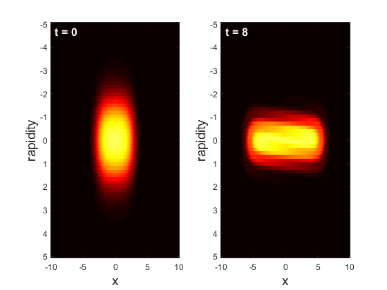
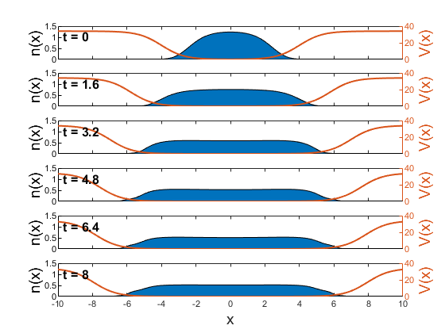
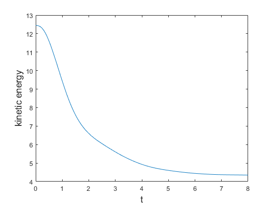

# Example: Bose gas in expanding box potential

In the [iFluid github repository](https://github.com/integrableFluid/iFluidMatlab) several example codes can be found. Here we go through one of the examples of a 1-dimensional Bose gas in an expanding box potential, which is described by the Lieb-Liniger model. As the box slowly expands the particles do "work" and lose kinetic energy, which effectively cools the gas. For a review of the physics of generalized hydrodynamics please refer to the [introductory iFluid paper](https://www.scipost.org/SciPostPhys.8.3.041), which includes a review of the theory.  
    

## Setting up and performing the calculation

First, we specify all the grids used in the simulation. These should be large enough to encompass the entire filling function i.e. there should be no quasiparticles at the grid edges. Note, this is not always the case. If the system extends beyond the grids, one should enable extrapolation via the `Options` arguments in the `iFluidSolver` class. However, this is only recommended if the system is homogeneous beyond the grids!

```MATLAB
N           = 2^6;                              % number of rapidity gridpoints
M           = 2^7;                              % number of spatial gridpoints
dt          = 0.025;                            % length of timestep

rmax        = 5;                                % max rapidity
xmax        = 10;                               % max posistion
tmax        = 8;                                % max time

[r_array,rw]= legzo(N, -rmax, rmax);            % rapidity grid and weights
x_array     = linspace(-xmax, xmax, M);         % position grid
t_array     = linspace(0, tmax, tmax/dt+1);     % array of timesteps 
```

Next, we specity the couplings of the model, namely the chemical potential and the interaction strength. In this example we keep the interaction strength constant at 1, Meanwhile, the chemical potential is a constant value minus the external potential. The external potential is a box with smooth edges realized using `tanh()` functions. Additionally, the box expands in time by moving the edges. The overall expression for the potential is a little cumbersome, so we utilize Matlabs symbolic toolbox to take derivatives for us.  
The couplings must be declared as anonymous functions with the handle `@(t,x)` and stored in a cell array along with their derivatives. The cell array must be structured as follows:  

|                       | **coupling 1**  | **coupling 2**    | ...
| : ---                 |: --- :          | : --- :           | ---
| **coupling function** |                 |                   |
|**temporal derivative**|                 |                   |
|**spatial derivative** |                 |                   |

In the case of the Lieb-Liniger model, the first coupling is the chemical potential, while the second coupling is the interaction strength. Note, the coupling derivatives can be left empty if the derivative is zero. Thus, the couplings are declared as follows:
```MATLAB
syms x t                                        % symbolic chemical potential
mu          = 2 - 17*( -tanh(0.75*(x + 4 + 4*tanh(0.3*t) )) + ...
                        tanh(0.75*(x - 4 - 4*tanh(0.3*t))) + 2);

mu_func     = matlabFunction( mu );             % convert to anonymous function
dmu_dt      = matlabFunction( diff(mu,t) );     % take temporal derivative
dmu_dx      = matlabFunction( diff(mu,x) );     % take spatial derivative

couplings   = { mu_func     , @(t,x) 1    ;     % coupling    
                dmu_dt      , []          ;     % d/dt coupling  
                dmu_dx      , []          };    % d/dx coupling
            

T           = 4;                                % temperature
```
Having specified the problem, we are now ready to simulate the dynamics of the system. To do so we must initialize a `LiebLinigerModel` object for the TBA of the model along with an `iFluidSolver` object for solving the GHD equations. In this case we choose the `SecondOrderSolver` class.  
As the initial state of the system we choose a thermal state. Since the quasiparticles of the Lieb-Liniger model are Fermions, the thermal state is a state obeying Fermi-Dirac statistics.
```MATLAB
% Initialize TBA for the Lieb-Liniger model
LLS         = LiebLinigerModel(x_array, r_array, rw, couplings);

% Intialize second order solver of the GHD equation
Solver2     = SecondOrderSolver(LLS, []); 

% Calculate thermal state at temperature T
theta_init  = LLS.calcThermalState(T);

% Propagate intial state according to the couplings
theta_t     = Solver2.propagateTheta(theta_init, t_array);
```
The last line of code calculates the filling function at every timestep in `t_array`. The output is a cell array, where every entry is the filling function stored in an `iFluidTensor`.  
Finally, we wish to calculate the atomic density of the Bosonic gas along with its kinetic energy. The function `calcCharges()` calculates the charge-density of the *i*'th conserved charge. By convention, the number operator is the 0th charge, while the Hamiltonian is the 2nd charge. To get only the kinetic energy we simply set the potential to zero before calculating the densities.
```MATLAB
% Set potential to zero, to only get kinetic contribution to energy
LLS.setCouplings( {@(t,x) 0 , @(t,x) 1} );

% Atomic density (charge index = 0), etomic density (charge index = 2)
q_t         = LLS.calcCharges([0 2], theta_t, t_array);
```
The output `q_t` is a 3-dimenional matrix, where the first index is space, 2nd index is time, and 3rd index is charge.  

## Plotting the results
To illustrate the result of the calculation we plot selected quantities. The code for plotting will not be shown here, but can be found in the example code in the git repository.  

First, it is nice to see the initial filling function along with the final one. The filling function is the density of occupied states over the density of total state. As the quasiparticles of the Lieb-Liniger model are fermions, the filling will be between 0 and 1. Initially the system is confined to a small box, however, the gas moves outwards as the box expands. Additionally, the states with high rapidity become depopulated during the expansion, as quasiparticles lose kinetic energy by performing "work" on the sides of the box. Note, how the filling is always zero at the edges of the grid - exactly how we wanted it!
<p align="center">
    
</p>
Next, we plot the atomic density along with the external potential. As the box expands, so does the gas. If one increases the expasion speed of the box, the gas will not be able to cool down as efficiently.
<p align="center">
    
</p>
Finally, we plot the total kinetic energy by integrating over the kinetic energy density. The figure clearly shows how the gas loses kinetic energy during the expansion, and how it settles to a steady level in the end. Since the final kinetic energy is lower than the initial *and* remains constant, the gas has been effectively cooled.
<p align="center">
    
</p>