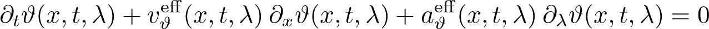
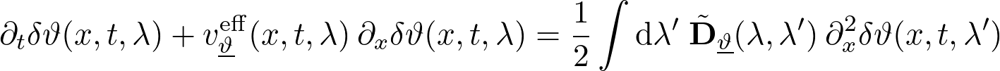
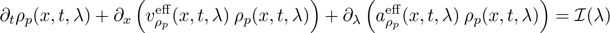

# Solvers for GHD propagation equation

iFluid implements a variety of solvers for solver the Euler-scale continuity equation or modifications thereof. Here we list the solvers currently implemented in iFluid. For a full documentations of the solvers we refer to the source code. For a guide on how to implement your own solver, [see here](solver.md).

## First order Euler solver
Simple first order solver of the Euler-scale propagation equation

Implemented in the `FirstOrderSolver` class.

## Second order Euler solver
Second order solver of the Euler-scale propagation equation

Implemented in the `SecondOrderSolver` class. More information regarding the method [here](https://www.scipost.org/SciPostPhys.8.3.041).

## Linearized diffusion solver
Solves the linearized diffusion equation with no inhomogeneous couplings

The solver propagates a small perturbation on top of a homogeneous background. Implemented in the `LinearDiffusionSolver` class. More information regarding the method [here](https://scipost.org/SciPostPhysCore.1.1.002).

## Collision integral solver (dimensional crossover)
Solves the Euler-scale propagation equation with added collision integral

Currently this class only works for the Lieb-Liniger model in the dimensional crossover regime. The collision integral takes into account collision with transverse excited atoms breaking the integrability of the model. Implemented in the `CollisionSolver` class. More information regarding the method [here](https://arxiv.org/abs/2006.08577).

