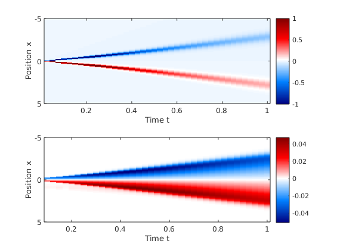

# Euler-scale dynamical correlation functions

By combining GHD with the fluctuation-dissipation theorem, one can calculate exact Euler-scale dynamical two-point correlation function. In GHD, each fluid cell (point in space-time) is described by its own generalized Gibbs ensemble (GGE). Thus, all equal-time, space-separated connected correlation functions vanish. However, over time the propagation of quasi-particles causes quantities in separated fluid cells to become correlated in a non-trivial manner. Hence, dynamical correlations at the Euler scale can be viewed as initial delta-functions correlations, which over time ballistically spread and propagate throughout the system.  

## Methods of `iFluidCorrelator` class
The class `iFluidCorrelator` contains all the methods necessary for computing the correlation functions.

### Constructor

#### `obj = iFluidCorrelator(coreObj, Options)`  
Construct an iFluidCorrelator for calculating Euler-scale correlations.  
**Inputs:**

- `coreObj`: `iFluidCore` object specifying the model and problem at hand.  
- `Options`: Struct of settings.   

**Returns:**

- `obj`: `iFluidCorrelator` object.


### Methods for calculating correlations

#### `[direct, indirect] = calc2PCorrelations(obj, theta_t, u_t, t_array, y_indices, VO1_t, VO2_0)`
Calculates the two-point correlation function , where *x* are all entries in `x_grid` specified in `iFluidCore`. The correlations split into a direct and an indirect part, where the full correlations is the sum of the two.  
**Inputs:**

- `theta_t`: Cell array of filling functions. First entry must be for time *t=0*.  
- `u_t`: Cell array of characteristic functions. First entry must be for time *t=0*.  
- `t_array`: Array of times corresponding to entries in `theta_t` and `u_t`.  
- `y_indices`: Array of indices, such that `x_grid(y_indices)` produces the desired values of *y*.
- `VO1_t`: Cell array containing form factors of operator *O1* at time `t_array(2:end)`.
- `VO2_0`: Form factor of operator *O2* at time *t=0*.

**Returns:**

- `direct`: Matrix containing the direct correlations.
- `indirect`: Matrix containing the indirect correlations.


## Examples

In this example we calculate the dynamic density-current correlations of a bump release in the Lieb-Liniger model.  

The full example code can be found in the /Examples folder in the [iFluid github repository](https://github.com/integrableFluid/iFluidMatlab).

### Setting up the problem and solving the dynamics

First we set up the grids, couplings, etc. The correlations implemented in iFluid version v1.1.0 only cover evolution with homogeneous couplings, although the initial state can be inhomogeneous.

```MATLAB
N           = 2^7;                              % number of rapidity gridpoints
M           = 2^8+1;                            % number of spatial gridpoints
dt          = 0.025;                            % length of timestep

rmax        = 7;                                % max rapidity
xmax        = 5;                                % max posistion
tmax        = 1;                                % max time

rap_array   = linspace(-rmax, rmax, N);         % rapidity grid
rap_w       = rap_array(2) - rap_array(1);      % rapidity quadrature weights
x_array     = linspace(-xmax, xmax, M);         % position grid
t_array     = linspace(0, tmax, tmax/dt+1);     % array of timesteps

% couplings are chemical potential and interaction strength
couplings  = { @(t,x) 0 , @(t,x) 1  ;           % couplings
               []       , []        ;           % d/dt couplings  
               []       , []        };          % d/dx couplings
                
T           = 0.5;                              % temperature                                 
```

Next, we solve the dynamics of the system. In order to calculate the correlations, we need the filling function and the position characteristic. 

```MATLAB
%% Initialize state and solve dynamics

% Initialize TBA for the Lieb-Liniger model
TBA         = LiebLinigerModel(x_array, rap_array, rap_w, couplings);

% Intialize second order solver of the GHD equation
Solver2     = SecondOrderSolver(TBA, []);

% Set inital chemical potential and calculate thermal state
coup_init   = { @(t,x) 2 - 2*x.^2  , @(t,x) 1};
theta_init  = TBA.calcThermalState(T, coup_init);

% Propagate intial state according to the couplings
[theta_t, u_t] = Solver2.propagateTheta(theta_init, t_array);
```

### Calculating correlations 

In order to calculate the correlations between the density and its associated current, , we need the one-particle form factor of the density  and the current operator. Both are available via the `calcCharges()` method in the `iFluidCore` class simply by passing a flag to the method. The method returns the form factors as a cell array for each time in `t_array`. Thus, we need the first cell of the current form factors and all the remaining cells of the density form factors.  


```MATLAB
% Initialize object for calculating correlations
iCorr       = iFluidCorrelator(TBA, []);

% Calculate form factors of density and associated current
calcFormFac = true;
[q,j,Vq,Vj] = TBA.calcCharges( 0, theta_t, t_array, calcFormFac );

% Calculate correlations at y = x_array((1+M)/2) and all times in t_array
[dir, indir]= iCorr.calc2PCorrelations( theta_t, u_t, t_array, (1+M)/2, Vq(2:end), Vj{1} );
```

### Plot results

Finally, we can plot the results of the calculation (direct above, indirect below).  



The direct and indirect correlations are plotted separately, as they are of very different scales. The direct correlations are the main contribution, and denote the correlations carried by quasi-particles with the inverse trajectories given by the characteristics. Meanwhile, the indirect correlations are due to disturbances of the trajectories due inhomogeneities in the initial state.
